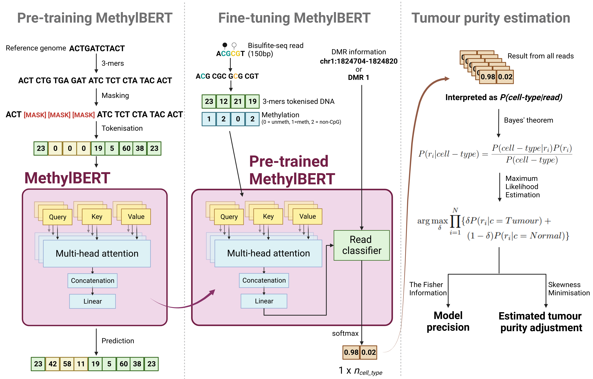

.. methylbert documentation master file, created by
   sphinx-quickstart on Wed Mar  5 20:35:11 2025.
   You can adapt this file completely to your liking, but it should at least
   contain the root `toctree` directive.

MethylBERT documentation
========================

.. toctree::
   :maxdepth: 1
   :caption: Contents:

   tutorials/01_Data_Preparation.md
   tutorials/02_Preprocessing_training_data.md
   tutorials/03_Preprocessing_bulk_data.md
   tutorials/04_Fine-tuning_MethylBERT_model.md
   tutorials/05_tumour_deconvolution.md