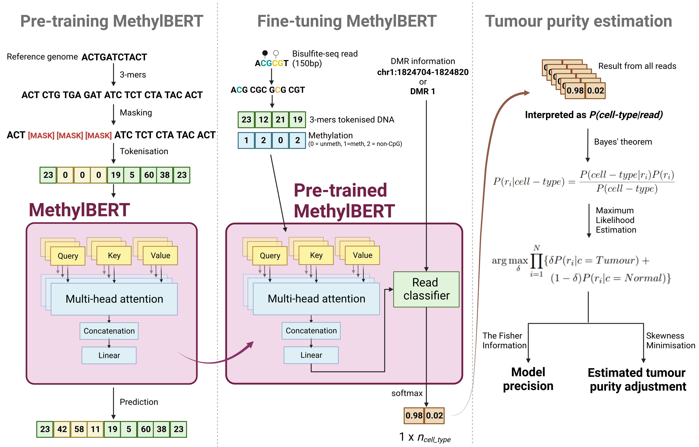

.. methylbert documentation master file, created by
   sphinx-quickstart on Wed Mar  5 20:35:11 2025.
   You can adapt this file completely to your liking, but it should at least
   contain the root `toctree` directive.

MethylBERT documentation
========================

*The figure was generated using [biorender](https://www.biorender.com/)*

BERT model to classify read-level DNA methylation data into tumour/normal and perform tumour deconvolution.
*MethylBERT* is implemented using `pytorch`_ and `transformers`_ 🤗.

.. _PyTorch: https://pytorch.org/
.. _transformers: https://huggingface.co/docs/transformers/index

Publication
**********

.. _Nature Communications: https://www.nature.com/articles/s41467-025-55920-z#article-info

*MethylBERT* paper is now online on `Nature Communications`_

*MethylBERT enables read-level DNA methylation pattern identification and tumour deconvolution using a Transformer-based model*

Yunhee Jeong, Clarissa Gerhäuser, Guido Sauter, Thorsten Schlomm, Karl Rohr and Pavlo Lutsik 

.. toctree::
   :maxdepth: 2
   :caption: Contents

   Data Preparation <tutorials/01_Data_Preparation.md>
   lib_entry.md
   cmd_entry.md
