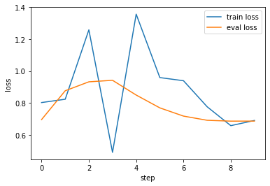

# _MethylBERT_ fine-tuning

Once the pure cell-type data is preprocessed following the [previous tutorial](https://github.com/hanyangii/methylbert/blob/main/tutorials/02_Preprocessing_training_data.ipynb), you can fine-tune the pre-trained MethylBERT model. 


```python
from methylbert.utils import set_seed
import warnings
warnings.filterwarnings("ignore") # Ignore warnings for a clear notebook

set_seed(42)
seq_len=150
n_mers=3
batch_size=5
num_workers=20
output_path = "tmp/fine_tune/"
```

    /omics/groups/OE0219/internal/Yunhee/anaconda3/envs/methylbert/lib/python3.7/site-packages/tqdm/auto.py:21: TqdmWarning: IProgress not found. Please update jupyter and ipywidgets. See https://ipywidgets.readthedocs.io/en/stable/user_install.html
      from .autonotebook import tqdm as notebook_tqdm


### Load training and evaluation data

The preprocessed data must be loaded into the `MethylBertFinetuneDataset` and the [pytorch DataLoader](https://pytorch.org/tutorials/beginner/basics/data_tutorial.html) object. 

You can change the number of workers and the batch size depending on the CPU/GPU resources you have.
Please find more detailed explanation [here](https://pytorch.org/docs/stable/data.html#torch.utils.data.DataLoader).


```python
from torch.utils.data import DataLoader
from methylbert.data.vocab import MethylVocab
from methylbert.data.dataset import MethylBertFinetuneDataset

# Creat a look-up table
tokenizer = MethylVocab(n_mers)

# Load the data files int a data set object
train_dataset = MethylBertFinetuneDataset("tmp/train_seq.csv", 
                                          tokenizer, 
                                          seq_len=seq_len)
test_dataset = MethylBertFinetuneDataset("tmp/test_seq.csv", 
                                         tokenizer,seq_len=seq_len) 

# Load the data into a data loader
train_data_loader = DataLoader(train_dataset, batch_size= batch_size, 
                               num_workers= num_workers, pin_memory=False,  
                               shuffle=True)
test_data_loader = DataLoader(test_dataset, batch_size= batch_size, 
                              num_workers= num_workers, pin_memory=True,  
                              shuffle=False)

```

    Building Vocab
    Total number of sequences :  3052
    # of reads in each label:  [1561. 1491.]
    Total number of sequences :  763
    # of reads in each label:  [383. 380.]


### Create _MethylBERT_ model

`MethylBERT FinetuneTrainer` gets the `DataLoader` objects and hyperparameters for the training as input. 


```python
from methylbert.trainer import MethylBertFinetuneTrainer
import os

trainer = MethylBertFinetuneTrainer(len(tokenizer), 
                      save_path=output_path, 
                      train_dataloader=train_data_loader, 
                      test_dataloader=test_data_loader,
                      lr=1e-4, with_cuda=False, 
                      log_freq=1,
                      #eval_freq=10, #activate this only when you want to evaluate the model with test_data_loader
                      warmup_step=3)
```

    The model is loaded on CPU


#### Load pre-training model from the uploaded models (huggingface.co/hanyangii/)

Pre-trained models with 2, 4, 6, 8, and 12 encoder blocks are available for MethylBERT. 
You can give an argument "hanyangii/methylbert_hg19_{number of encoder blocks}l" to the `load` function. 


```python
trainer.load("hanyangii/methylbert_hg19_4l")
```

    Restore the pretrained model hanyangii/methylbert_hg19_4l


    config.json:   0%|          | 0.00/1.11k [00:00<?, ?B/s]


    pytorch_model.bin:   0%|          | 0.00/120M [00:00<?, ?B/s]


    Some weights of MethylBertEmbeddedDMR were not initialized from the model checkpoint at hanyangii/methylbert_hg19_4l and are newly initialized: ['dmr_encoder.0.weight', 'read_classifier.0.bias', 'read_classifier.0.weight', 'read_classifier.3.bias', 'read_classifier.3.weight', 'read_classifier.4.bias', 'read_classifier.4.weight']
    You should probably TRAIN this model on a down-stream task to be able to use it for predictions and inference.


    Total Parameters: 46929874


#### Load pre-training model from a local directory

If you have the pre-trained model saved in a directory containing `config.json` and `pytorch_model.bin` files


```python
ls ../test/data/pretrained_model/
```

    config.json@  pytorch_model.bin@


You can directly load the model using `load` function to `MethylBertFinetuneTrainer`. 


```python
trainer.load("../test/data/pretrained_model/")
```

    Restore the pretrained model ../test/data/pretrained_model/
    Total Parameters: 32754130


#### Train the _MethylBERT_ model without pre-training
If you do not have a pre-trained _MethylBERT_ model, you can create a new _MethylBERT_ model from a configuration file. 
For example, the baseline BERT model config file can be downlaoded from from https://huggingface.co/bert-base-uncased/blob/main/config.json.


```python
cat ../test/data/config.json
```

    {
      "architectures": [
        "BertForMaskedLM"
      ],
      "attention_probs_dropout_prob": 0.1,
      "gradient_checkpointing": false,
      "hidden_act": "gelu",
      "hidden_dropout_prob": 0.1,
      "hidden_size": 768,
      "initializer_range": 0.02,
      "intermediate_size": 3072,
      "layer_norm_eps": 1e-12,
      "max_position_embeddings": 512,
      "model_type": "bert",
      "num_attention_heads": 12,
      "num_hidden_layers": 12,
      "pad_token_id": 0,
      "position_embedding_type": "absolute",
      "transformers_version": "4.6.0.dev0",
      "type_vocab_size": 2,
      "use_cache": true,
      "vocab_size": 30522
    }


Then `create_model` function of the trainer creates a new _MethylBERT_ from the config file.


```python
trainer.create_model(config_file="../test/data/pretrained_model/config.json")

```

    Total Parameters: 32754130


`train` function starts the training of _MethylBERT_ model during the given number of steps. 


```python
trainer.train(steps=10)
```

    /omics/groups/OE0219/internal/Yunhee/anaconda3/envs/dnabert/lib/python3.6/site-packages/torch/autocast_mode.py:156: UserWarning: In CPU autocast, but the target dtype is not supported. Disabling autocast.
    CPU Autocast only supports dtype of torch.bfloat16 currently.
      warnings.warn(error_message)


    
    Train Step 0 iter - loss : 0.802449 / lr : 0.000033
    Running time for iter = 0.6947791576385498
    Step 0 loss (0.695615) is lower than the current min loss (inf). Save the model at tmp/fine_tune/
    Step:0 Model Saved on: tmp/fine_tune/


    /omics/groups/OE0219/internal/Yunhee/anaconda3/envs/dnabert/lib/python3.6/site-packages/torch/autocast_mode.py:156: UserWarning: In CPU autocast, but the target dtype is not supported. Disabling autocast.
    CPU Autocast only supports dtype of torch.bfloat16 currently.
      warnings.warn(error_message)


    
    Train Step 1 iter - loss : 0.823174 / lr : 0.000067
    Running time for iter = 0.621410608291626


    /omics/groups/OE0219/internal/Yunhee/anaconda3/envs/dnabert/lib/python3.6/site-packages/torch/autocast_mode.py:156: UserWarning: In CPU autocast, but the target dtype is not supported. Disabling autocast.
    CPU Autocast only supports dtype of torch.bfloat16 currently.
      warnings.warn(error_message)


    
    Train Step 2 iter - loss : 1.258267 / lr : 0.000100
    Running time for iter = 0.5103580951690674


    /omics/groups/OE0219/internal/Yunhee/anaconda3/envs/dnabert/lib/python3.6/site-packages/torch/autocast_mode.py:156: UserWarning: In CPU autocast, but the target dtype is not supported. Disabling autocast.
    CPU Autocast only supports dtype of torch.bfloat16 currently.
      warnings.warn(error_message)


    
    Train Step 3 iter - loss : 0.490022 / lr : 0.000100
    Running time for iter = 0.5122716426849365


    /omics/groups/OE0219/internal/Yunhee/anaconda3/envs/dnabert/lib/python3.6/site-packages/torch/autocast_mode.py:156: UserWarning: In CPU autocast, but the target dtype is not supported. Disabling autocast.
    CPU Autocast only supports dtype of torch.bfloat16 currently.
      warnings.warn(error_message)


    
    Train Step 4 iter - loss : 1.356685 / lr : 0.000100
    Running time for iter = 0.5860369205474854


    /omics/groups/OE0219/internal/Yunhee/anaconda3/envs/dnabert/lib/python3.6/site-packages/torch/autocast_mode.py:156: UserWarning: In CPU autocast, but the target dtype is not supported. Disabling autocast.
    CPU Autocast only supports dtype of torch.bfloat16 currently.
      warnings.warn(error_message)


    
    Train Step 5 iter - loss : 0.959048 / lr : 0.000100
    Running time for iter = 0.6873147487640381


    /omics/groups/OE0219/internal/Yunhee/anaconda3/envs/dnabert/lib/python3.6/site-packages/torch/autocast_mode.py:156: UserWarning: In CPU autocast, but the target dtype is not supported. Disabling autocast.
    CPU Autocast only supports dtype of torch.bfloat16 currently.
      warnings.warn(error_message)


    
    Train Step 6 iter - loss : 0.939311 / lr : 0.000100
    Running time for iter = 0.4517858028411865


    /omics/groups/OE0219/internal/Yunhee/anaconda3/envs/dnabert/lib/python3.6/site-packages/torch/autocast_mode.py:156: UserWarning: In CPU autocast, but the target dtype is not supported. Disabling autocast.
    CPU Autocast only supports dtype of torch.bfloat16 currently.
      warnings.warn(error_message)


    
    Train Step 7 iter - loss : 0.776077 / lr : 0.000100
    Running time for iter = 0.6021583080291748
    Step 7 loss (0.691268) is lower than the current min loss (0.695615). Save the model at tmp/fine_tune/
    Step:7 Model Saved on: tmp/fine_tune/


    /omics/groups/OE0219/internal/Yunhee/anaconda3/envs/dnabert/lib/python3.6/site-packages/torch/autocast_mode.py:156: UserWarning: In CPU autocast, but the target dtype is not supported. Disabling autocast.
    CPU Autocast only supports dtype of torch.bfloat16 currently.
      warnings.warn(error_message)


    
    Train Step 8 iter - loss : 0.657497 / lr : 0.000100
    Running time for iter = 0.4712505340576172
    Step 8 loss (0.685933) is lower than the current min loss (0.691268). Save the model at tmp/fine_tune/
    Step:8 Model Saved on: tmp/fine_tune/


    /omics/groups/OE0219/internal/Yunhee/anaconda3/envs/dnabert/lib/python3.6/site-packages/torch/autocast_mode.py:156: UserWarning: In CPU autocast, but the target dtype is not supported. Disabling autocast.
    CPU Autocast only supports dtype of torch.bfloat16 currently.
      warnings.warn(error_message)


    
    Train Step 9 iter - loss : 0.690212 / lr : 0.000100
    Running time for iter = 0.4791133403778076


It creates six files in the given `save_path`:
1. `config.json` and `pytorch_model.bin`: model configuration and the trained `MethylBERT` model
2. `dmr_encoder.pickle` : The trained DMR encoder in the _MethylBERT_ model
3. `read_classification_model.pickle` : The trained fully connected neural network for read classification
4. `train.csv` and `eval.csv` : tracked training and evaluation loss and accuracy values during the training


```python
ls tmp/fine_tune/
```

    config.json         eval.csv           read_classification_model.pickle
    dmr_encoder.pickle  pytorch_model.bin  train.csv


```python
import pandas as pd
df_train  = pd.read_csv("tmp/fine_tune/train.csv", sep="\t")
df_train.head()
```


<div>
<style scoped>
    .dataframe tbody tr th:only-of-type {
        vertical-align: middle;
    }

    .dataframe tbody tr th {
        vertical-align: top;
    }

    .dataframe thead th {
        text-align: right;
    }
</style>
<table border="1" class="dataframe">
  <thead>
    <tr style="text-align: right;">
      <th></th>
      <th>step</th>
      <th>loss</th>
      <th>ctype_acc</th>
      <th>lr</th>
    </tr>
  </thead>
  <tbody>
    <tr>
      <th>0</th>
      <td>0</td>
      <td>0.802449</td>
      <td>0.2</td>
      <td>0.000033</td>
    </tr>
    <tr>
      <th>1</th>
      <td>1</td>
      <td>0.823174</td>
      <td>0.0</td>
      <td>0.000067</td>
    </tr>
    <tr>
      <th>2</th>
      <td>2</td>
      <td>1.258267</td>
      <td>0.2</td>
      <td>0.000100</td>
    </tr>
    <tr>
      <th>3</th>
      <td>3</td>
      <td>0.490022</td>
      <td>0.8</td>
      <td>0.000100</td>
    </tr>
    <tr>
      <th>4</th>
      <td>4</td>
      <td>1.356685</td>
      <td>0.2</td>
      <td>0.000100</td>
    </tr>
  </tbody>
</table>
</div>


```python
df_eval  = pd.read_csv("tmp/fine_tune/eval.csv", sep="\t")
df_eval.head()
```


<div>
<style scoped>
    .dataframe tbody tr th:only-of-type {
        vertical-align: middle;
    }

    .dataframe tbody tr th {
        vertical-align: top;
    }

    .dataframe thead th {
        text-align: right;
    }
</style>
<table border="1" class="dataframe">
  <thead>
    <tr style="text-align: right;">
      <th></th>
      <th>step</th>
      <th>loss</th>
      <th>ctype_acc</th>
    </tr>
  </thead>
  <tbody>
    <tr>
      <th>0</th>
      <td>0</td>
      <td>0.695615</td>
      <td>0.522936</td>
    </tr>
    <tr>
      <th>1</th>
      <td>1</td>
      <td>0.876368</td>
      <td>0.501966</td>
    </tr>
    <tr>
      <th>2</th>
      <td>2</td>
      <td>0.932430</td>
      <td>0.501966</td>
    </tr>
    <tr>
      <th>3</th>
      <td>3</td>
      <td>0.942029</td>
      <td>0.501966</td>
    </tr>
    <tr>
      <th>4</th>
      <td>4</td>
      <td>0.849511</td>
      <td>0.501966</td>
    </tr>
  </tbody>
</table>
</div>


```python
import seaborn as sns
import matplotlib.pyplot as plt
sns.lineplot(data=df_train, x="step", y="loss", label="train loss")
sns.lineplot(data=df_eval, x="step", y="loss", label="eval loss")
plt.show()
```


    

    


```python
sns.lineplot(data=df_train, x="step", y="lr", label="learning rate", color="m")
plt.show()
```


    

    

